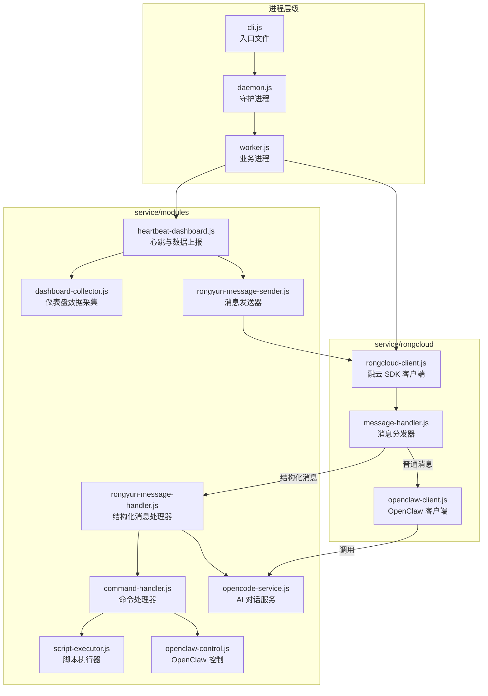
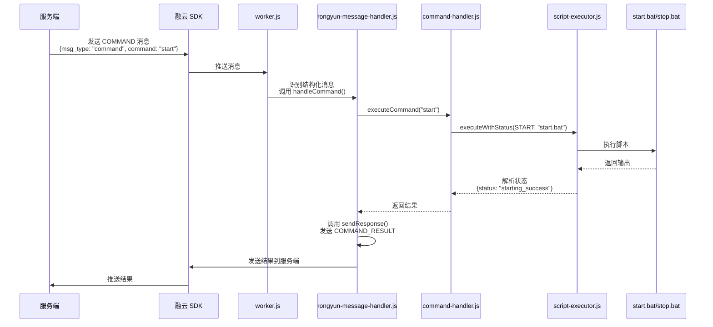
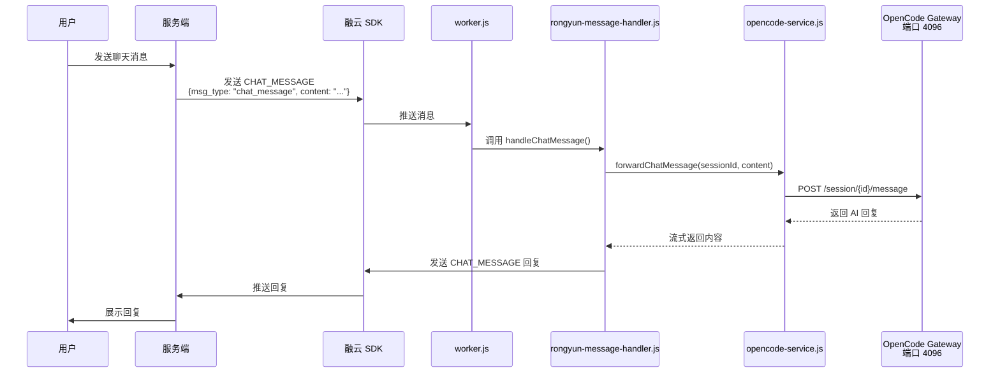
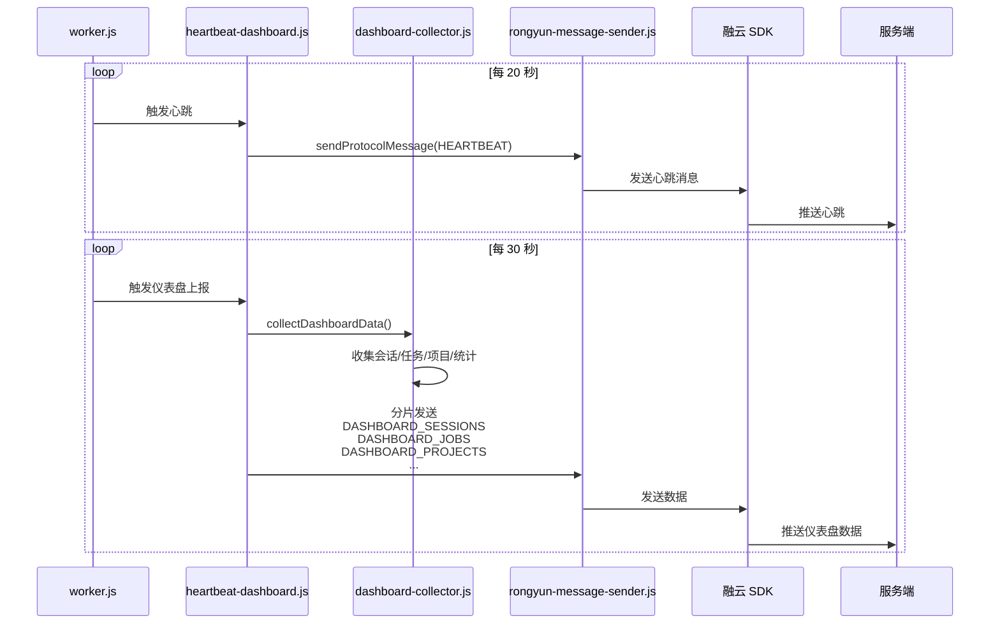
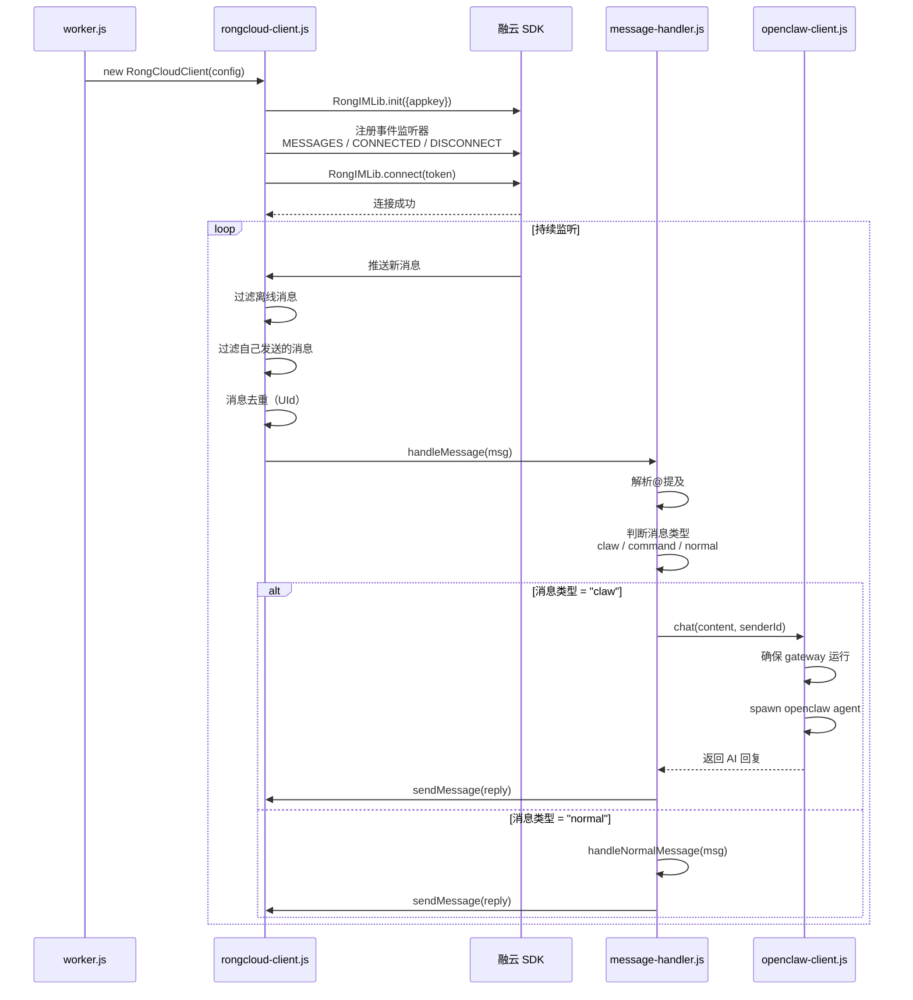
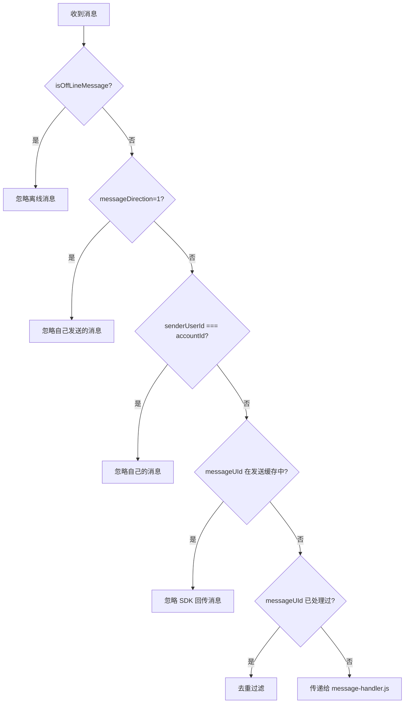
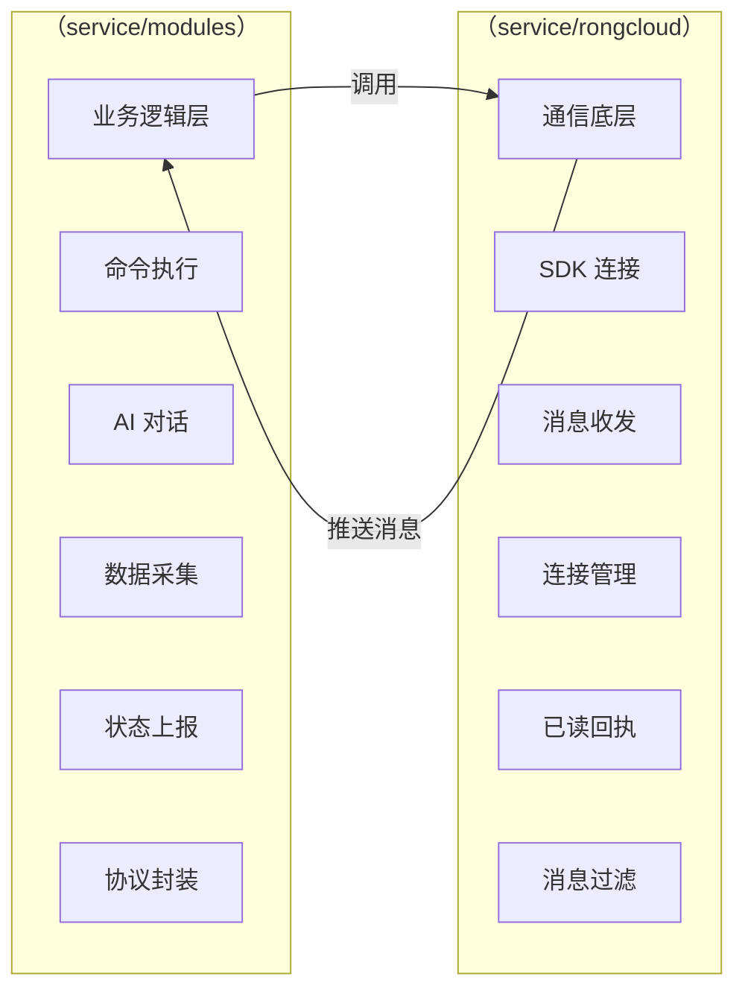

# cli项目架构

## 1. 项目概述

`nodejs_cli_client` 是一个静默后台服务（Silent Background Service），用于设备管理、自动启动、崩溃恢复、RongCloud 即时通讯（IM）以及与 OpenClaw AI 服务的集成。

### 1.1 项目定位
- **运行模式**：作为系统服务在后台持续运行（Windows 服务 / Linux systemd / macOS launchd）
- **核心功能**：接收远程指令、执行命令、上报设备状态、AI 聊天交互

### 1.2 技术栈
- **运行时**：Node.js（纯 JavaScript，无 Electron 依赖）
- **通信协议**：RongCloud IM（融云即时通讯）
- **进程架构**：Daemon（守护进程）+ Worker（业务进程）双进程模型
- **AI 集成**：OpenClaw Gateway（本地 HTTP 服务，端口 18789）+ OpenCode 服务（端口 4096）

---

## 2. 核心架构流程图



---

## 3. （service/modules）详解

### 3.1 核心职责范围

 `service/modules` 目录包含 **19 个文件**，覆盖以下功能域：

| 功能域 | 负责文件 | 代码行数 | 说明 |
|--------|----------|----------|------|
| **结构化消息处理** | `rongyun-message-handler.js` | 250 行 | 处理服务端发送的协议消息（COMMAND、CHAT_MESSAGE、CREATE_OPENCODE_SESSION、DELETE_OPENCODE_SESSION） |
| **命令执行** | `command-handler.js` | 152 行 | 封装 start/stop/restart/status/config_fix 命令 |
| **脚本执行引擎** | `script-executor.js` | 584 行 | 执行 bat/sh 脚本，解析状态，超时控制，进程管理 |
| **数据采集** | `dashboard-collector.js` | 588 行 | 收集 OpenClaw 会话、定时任务、审批、项目、任务、使用统计 |
| **心跳与上报** | `heartbeat-dashboard.js` | 153 行 | 定时发送心跳和仪表盘数据到服务端 |
| **消息发送** | `rongyun-message-sender.js` | 157 行 | 封装所有上行消息（连接通知、心跳、命令结果、聊天回复、仪表盘数据） |
| **AI 对话服务** | `opencode-service.js` | 337 行 | 调用 OpenCode Gateway 进行 AI 对话，流式响应处理 |
| **OpenClaw 控制** | `openclaw-control.js` | 128 行 | 执行 OpenClaw 启动/停止/重启/状态检查 |
| **服务启动** | `opencode-starter.js` | 195 行 | 检查并启动本地 OpenCode 服务（端口 4096） |
| **消息路由** | `structured-message-router.js` | 118 行 | 在 worker.js 层拦截并路由结构化消息 |
| **业务处理** | `business-message-handler.js` | 118 行 | 处理普通消息中的命令和聊天 |
| **普通消息** | `normal-message-handler.js` | 42 行 | 调用 OpenClaw AI 处理普通文本消息 |
| **工具模块** | `config.js`, `auth.js`, `mac-address.js`, `port-checker.js`, `openclaw-enum.js`, `service-manager.js`, `opencode-starter.js` | ~300 行 | 配置、认证、MAC 地址、端口检查、枚举定义、服务管理 |


### 3.2 开发的关键流程

#### 3.2.1 命令执行流程



#### 3.2.2 AI 聊天流程



#### 3.2.3 心跳与仪表盘上报流程



---

## 4. （service/rongcloud）详解

### 4.1 核心职责范围

 `service/rongcloud` 目录包含 **8 个文件**，专注于 **RongCloud IM SDK 的底层封装**：

| 功能域 | 负责文件 | 代码行数 | 说明 |
|--------|----------|----------|------|
| **融云客户端** | `rongcloud-client.js` | 331 行 | SDK 初始化、连接管理、消息收发、已读回执、去重过滤 |
| **消息分发** | `message-handler.js` | 172 行 | 消息类型判断、@提及解析、分发到 OpenClawClient 或普通处理器 |
| **OpenClaw 调用** | `openclaw-client.js` | 463 行 | 通过 CLI 调用 openclaw agent，gateway 启动，环境修复 |
| **类型定义** | `types.js`, `message-types.js` | 31 行 | 消息类型枚举 |
| **模块导出** | `index.js` | 19 行 | 统一导出 |
| **环境适配** | `env-polyfill.js`, `openclaw-config.js` | ~100 行 | 环境变量修复、配置加载 |

**总计：约 1,100+ 行代码**

### 4.2 开发的关键流程

#### 4.2.1 融云连接与消息接收流程



#### 4.2.2 消息过滤机制

 `rongcloud-client.js` 中实现了四层消息过滤：



---

## 5. 消息类型技术分析

### 5.1 两种消息类型的本质区别

| 维度 | 普通消息（RC:TxtMsg） | 自定义消息（自定义协议） |
|------|----------------------|------------------------|
| **融云 SDK 标识** | `messageType: "RC:TxtMsg"` | `messageType: "claw"` 或自定义类型 |
| **内容格式** | 纯文本字符串 | JSON 结构化数据 |
| **适用场景** | 用户聊天、简单文本交互 | 机器间通信、协议指令 |
| **扩展性** | 低（需解析文本） | 高（可直接解析 JSON 字段） |
| **消息体示例** | `"启动服务"` | `{"msg_type":"command","command":"start"}` |

### 5.2 实际代码中的消息处理路径

在 `worker.js` 中，两条路径**并行存在**，互不干扰：

```javascript
// worker.js 中的消息处理逻辑（第 316-382 行）

messageHandler.handleMessage = async (msg) => {
    // 路径 1：结构化消息处理
    if (msg.content 包含 msg_type) {
        // 解析 JSON，提取 command/chat_message 等
        await rongyunMessageHandler.handle(messageData);  
        return;
    }
    
    // 路径 2：普通消息处理
    return originalHandleMessage(msg);  
};
```

### 

---

## 6. 业务流程图总结



| 维度 | service/modules | service/rongcloud |
|------|------|------|
| **代码量** | ~3,100+ 行 | ~1,100+ 行 |
| **文件数** | 19 个文件 | 8 个文件 |
| **职责层次** | 业务逻辑层 | 通信底层 |
| **核心能力** | 命令执行、AI 对话、数据上报 | SDK 连接、消息收发、连接保活 |
| **对外依赖** | 依赖SDK 连接 | 依赖融云 SDK |
| **独立程度** | 可独立测试业务逻辑 | 可独立测试连接功能 |
| **与消息类型关系** | 决定消息内容格式 | 不感知消息内容格式 |

---

